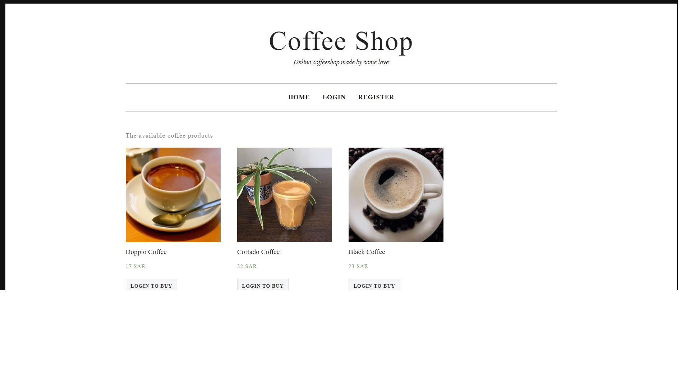
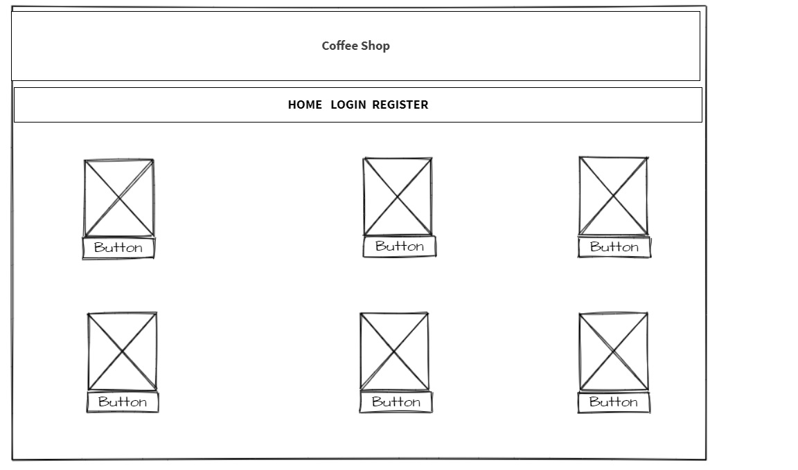
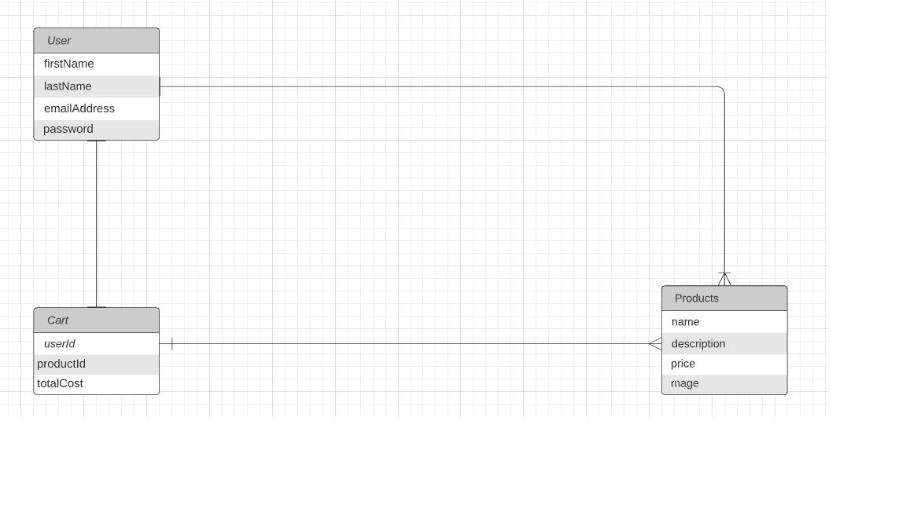

# Coffee Shop 
E-commerce website, offers coffee types to customers, the customer can order any coffee through the website  , also the user can choose more than one drink.

## Planning Story
I chose this idea due to the popularity of coffee everywhere, and due to the large demand for it, I created a simple website about order management so that it makes it easier for the user to order the coffee he loves!

## List of technologies used:
- Figma
- Lucidchart
- VS code.
- Express - Node.js.
- Mongoose.
- CSS.
 - JavaScript(Library) : jQuery


### User Stories
- As a user I want to sign in/up in the new account
- As a user I want to Create a new order
- As a user I want to Read multiple types of coffee
- As a user I want to Read a single type of coffee
- As a user I want to Update a < product >  my order
- As a user I want to Delete a < product >  my order
### Catalog of Routes
Verb         |  URI Pattern
------------ | -------------
GET | /product
GET | /product/:id
POST | /product
PUT | /cart/:idProduct
DELETE | /cart/:idProduct

## Installation instructions:
```bash 
# Start the project
    $ npm start # start server
    $ OR 
    $ nodemon server.js
    $ npm i express
    $ npm i -g nodemon
    $ npm i ejs
    $ npm i ejs
    $ npm i mongoose
    $ npm i express mongoose
    $ npm i express-ejs-layouts ejs
    $ npm i moment
    $ npm install method-override
    $ npm i express mongoose ejs method-override express-ejs-layouts
    $ npm i dotenv
    $ npm i bcrypt
    $ npm i passport passport-local express-session
    $ npm install connect-flash
    $ npm i express-validator
    $ npm install --save toastify-js
    $ npm install axios
    $ npm i express mongoose dotenv
    $ npm i bcryptjs
    $ npm i jasonwebtoken
    $ npm install cookie-parser

```
### Unsolved Problems
- Still need to more time to add Checkout but in the future I will add it! The idea was that the order is sent to the e-mail after finish the order, but this problem has not been resolved!
- The payment option has not been resolved and more options have been added, such as delivering the order to the customer's home!
## Images
#### App Screenshot:

---
### Wireframe
A **wireframe** is a layout of a web page that demonstrates what interface elements will exist on key pages.


---
#### ERD:
 An **entity relationship diagram (ERD)** shows the relationships of entity sets stored in a database. An entity in this context is an object, a component of data. An entity set is a collection of similar entities. These entities can have attributes that define its properties.
)

